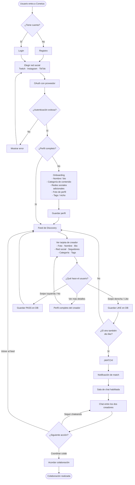

# Conetza — Diagrama de Flujo

```mermaid
flowchart TD
    A([Usuario entra a Conetza]) --> B{¿Tiene cuenta?}

    B -- No --> C[Registro]
    B -- Sí --> D[Login]

    C --> E[Elegir red social\nTwitch · Instagram · TikTok]
    D --> E

    E --> F[OAuth con proveedor]
    F --> G{¿Autenticación exitosa?}
    G -- No --> H[Mostrar error] --> E
    G -- Sí --> I{¿Perfil completo?}

    I -- No --> J[Onboarding\n- Nombre / bio\n- Categoría de contenido\n- Redes sociales adicionales\n- Foto de perfil\n- Tags / nicho]
    J --> K[Guardar perfil]
    K --> L[Feed de Discovery]

    I -- Sí --> L

    L --> M[Ver tarjeta de creador\n- Foto · Nombre · Bio\n- Red social · Seguidores\n- Categoría · Tags]

    M --> N{¿Qué hace el usuario?}

    N -- Swipe derecha / Like --> O[Guardar LIKE en DB]
    N -- Swipe izquierda / No --> P[Guardar PASS en DB]
    N -- Ver más detalles --> Q[Perfil completo del creador] --> M

    O --> R{¿El otro también\ndio like?}
    R -- No --> L
    R -- Sí --> S[¡MATCH!]

    P --> L

    S --> T[Notificación de match]
    T --> U[Sala de chat habilitada]

    U --> V[Chat entre los dos creadores]
    V --> W{¿Siguiente acción?}

    W -- Seguir chateando --> V
    W -- Coordinar colab --> X[Acordar colaboración]
    W -- Volver al feed --> L

    X --> Y([Colaboración realizada])
```
